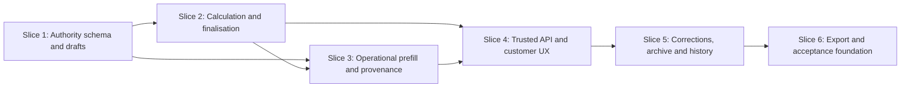

# Financial Actuals Authority Foundation Implementation Plan

> **For agentic workers:** REQUIRED SUB-SKILL: Use superpowers:subagent-driven-development (recommended) or superpowers:executing-plans to implement this plan task-by-task. Steps use checkbox (`- [ ]`) syntax for tracking.

**Goal:** Productise the existing Financial Actuals capability with tenant/Base-scoped relational authority, immutable revisions, deterministic calculations, operational provenance and adapted customer workflows while keeping Financials `COMING_SOON`.

**Architecture:** A stable `financial_actuals` aggregate owns one active draft and an immutable current-final revision. Three additive PostgreSQL migrations establish draft authority, deterministic calculation/finalisation, and operational prefill/provenance; narrow trusted server/browser APIs adapt the existing Financial UX without local persistence or authoritative Quote/Fleet dependencies.

**Tech Stack:** PostgreSQL/Supabase migrations and SECURITY DEFINER RPCs, Node/Vercel trusted API handlers, React 19 + TypeScript 4.9 + MUI, Jest/Testing Library, PGlite, Playwright Chromium/WebKit.

**Spec:** `docs/superpowers/specs/2026-08-22-financial-actuals-authority-foundation-design.md`

## Global Constraints

- Keep `financials`, `financials/margin-analysis` and `financials/invoice-export` at `COMING_SOON`.
- Do not import or trust browser-local Financial Actuals or Quotes.
- Do not depend on PR #23 or unreleased Fleet Maintenance authority.
- Use canonical decimal strings and PostgreSQL `numeric`; JavaScript `number` is not financial authority.
- Use `ROUND_HALF_AWAY_FROM_ZERO` at the exact stages defined by `FINANCIAL_ACTUAL_V1`.
- Keep FINAL revisions and child evidence immutable; corrections create a new DRAFT revision.
- Keep the current FINAL pointer unchanged until correction finalisation succeeds.
- Permit exactly one active DRAFT per aggregate.
- Reject aggregate archive while an active DRAFT exists.
- Preserve original operational/source values whenever an override exists.
- Never infer financial cost from Aircraft, Equipment, Personnel or product identity/usage.
- Remove fabricated Quoted Margin and heuristic Compliance Score; add no substitute synthetic metric.
- Mutations must write audit/outbox atomically and must fail closed on tenant, Base, permission or version mismatch.
- No Production migration, deployment, alias change, genuine-data mutation or Product Maturity promotion is part of this plan.

## File and domain map

| Unit | Files | Responsibility |
|---|---|---|
| Draft authority | `supabase/migrations/20260822100000_financial_actual_authority.sql` | Tables, constraints, permissions, RLS, reads, create/update draft |
| Calculation/final lifecycle | `supabase/migrations/20260822110000_financial_actual_calculation_and_finalisation.sql` | V1 calculator, frozen snapshots and atomic finalisation |
| Operational provenance | `supabase/migrations/20260822120000_financial_actual_operational_prefill.sql` | Completed-Mission prefill, explicit import, overrides and source drift |
| Correction lifecycle | `supabase/migrations/20260822130000_financial_actual_correction_and_archive.sql` | Correction draft creation, revision history and aggregate archive |
| Database tests | `src/__tests__/financialActualAuthorityMigration.test.js`, `src/__tests__/financialActualAuthorityBehavior.test.js`, `src/__tests__/financialActualCalculationParity.test.js`, `src/__tests__/financialActualOperationalPrefill.test.js` | Structural and behavioral authority proof |
| Calculation client | `src/domain/financialActuals/decimal.ts`, `src/domain/financialActuals/calculation.ts`, `src/domain/financialActuals/fixtures.ts` | Decimal validation and non-authoritative preview with parity fixtures |
| Trusted API | `server/financial-actuals-repository.js`, `server/financial-actuals-api.js`, `server/operational-dispatcher.js` | Trusted context, permissions, safe validation and RPC mapping |
| Browser contract | `src/services/financialActualsApi.ts`, `src/types/financialActuals.ts` | Fail-whole response decoding and exact wire types |
| Customer UI | `src/pages/FinancialsList.tsx`, `src/pages/ActualCreate.tsx`, `src/pages/ActualDetail.tsx`, `src/components/financialActuals/*` | Progressive authoritative workflow |
| Gate/governance | `src/components/productMaturity/ProductMaturitySurface.tsx`, focused tests only | Development-only E2E override; Production remains fail-closed |
| Export preparation | `src/utils/actualReportPdf.ts`, `src/components/financialActuals/RevisionEvidence.tsx` | Exact-revision PDF provenance; normal export remains gated |
| Browser acceptance | `e2e/financial-actuals/financial-actuals.spec.ts`, `playwright.financial-actuals.config.ts` | Chromium/WebKit responsive and second-session workflow |

## Migration sequence

1. `20260822100000_financial_actual_authority.sql`
2. `20260822110000_financial_actual_calculation_and_finalisation.sql`
3. `20260822120000_financial_actual_operational_prefill.sql`
4. `20260822130000_financial_actual_correction_and_archive.sql`

The migrations are additive and ordered. No historical migration is edited. Export preparation and UI adaptation require no additional database migration.

---

### Task 1: Financial authority foundation

**Files:**
- Create: `supabase/migrations/20260822100000_financial_actual_authority.sql`
- Create: `src/__tests__/financialActualAuthorityMigration.test.js`
- Create: `src/__tests__/financialActualAuthorityBehavior.test.js`

**Interfaces:**
- Produces: `financial_actuals`, `financial_actual_revisions`, `financial_actual_work_entries`, `financial_actual_cost_lines`, `financial_actual_value_provenance`.
- Produces RPCs: `ftf_list_financial_actuals(uuid,uuid,uuid,uuid,integer)`, `ftf_read_financial_actual(uuid,uuid,uuid,integer)`, `ftf_create_financial_actual(uuid,uuid,jsonb)`, `ftf_update_financial_actual_draft(uuid,uuid,uuid,uuid,integer,jsonb)`.
- Produces permissions: `financial_actuals.read/create/update/finalise/archive/export`.
- Consumes: existing organisation, membership, operating-location, Client, Property, Field, Job, Mission, audit and outbox tables.

- [ ] **Step 1: Write structural RED tests**

```js
test('defines the tenant-scoped Financial Actual aggregate and children', () => {
  for (const table of ['financial_actuals','financial_actual_revisions','financial_actual_work_entries','financial_actual_cost_lines','financial_actual_value_provenance']) {
    expect(sql).toMatch(new RegExp(`create table public\\.${table}`));
    expect(sql).toMatch(new RegExp(`alter table public\\.${table} enable row level security`));
    expect(sql).toMatch(new RegExp(`alter table public\\.${table} force row level security`));
  }
  expect(sql).toContain('current_final_revision_id');
  expect(sql).toContain('active_draft_revision_id');
  expect(sql).toContain('unique (organisation_id, financial_actual_id, revision_number)');
});

test('provisions explicit Financial Actual permissions only to admin by default', () => {
  for (const action of ['read','create','update','finalise','archive','export']) {
    expect(sql).toContain(`financial_actuals.${action}`);
  }
  expect(sql).toMatch(/new\.code='admin'/);
  expect(sql).not.toMatch(/new\.code='contractor'.*financial_actuals/s);
});
```

- [ ] **Step 2: Run structural tests and confirm RED**

Run:

```bash
CI=true npm test -- --runInBand src/__tests__/financialActualAuthorityMigration.test.js
```

Expected: FAIL because the migration does not exist.

- [ ] **Step 3: Write behavioral RED tests using PGlite**

```js
test('denies cross-tenant, cross-Base and missing-permission create', async () => {
  await expect(callCreate({ organisationId: orgB, actorId: actorA, operatingLocationId: baseB })).rejects.toThrow();
  await expect(callCreate({ organisationId: orgA, actorId: baseAOnlyActor, operatingLocationId: baseB })).rejects.toThrow(/LOCATION_FORBIDDEN/);
  await expect(callCreate({ organisationId: orgA, actorId: readOnlyActor, operatingLocationId: baseA })).rejects.toThrow(/FINANCIAL_ACTUAL_FORBIDDEN/);
});

test('allows one draft and rejects stale draft updates', async () => {
  const created = await callCreate(validCreate);
  expect(created.record.active_draft_revision_id).toBe(created.revision.id);
  await callUpdate({ ...validUpdate, revisionId: created.revision.id, expectedVersion: 1 });
  await expect(callUpdate({ ...validUpdate, revisionId: created.revision.id, expectedVersion: 1 })).resolves.toMatchObject({ conflict: true, current_version: 2 });
});
```

- [ ] **Step 4: Implement the authority migration minimally**

Implement exact table constraints and command guards. The create command starts with this authority sequence:

```sql
if not public.ftf_actor_has_permission(p_organisation_id,p_actor_internal_user_id,'financial_actuals.create') then
  raise exception using errcode='42501',message='FINANCIAL_ACTUAL_FORBIDDEN';
end if;
if not public.ftf_maintenance_location_allowed(p_organisation_id,p_actor_internal_user_id,v_operating_location_id) then
  raise exception using errcode='42501',message='FINANCIAL_ACTUAL_LOCATION_FORBIDDEN';
end if;
```

Use an organisation advisory lock to allocate `FA-%06s`, re-prove the exact Client→Property→Field→Job→optional Mission chain, and create aggregate plus revision 1 DRAFT atomically. Grant service-role execute only on checked public RPCs; keep helpers private.

- [ ] **Step 5: Run Task 1 focused tests**

```bash
CI=true npm test -- --runInBand \
  src/__tests__/financialActualAuthorityMigration.test.js \
  src/__tests__/financialActualAuthorityBehavior.test.js \
  src/__tests__/migrationLint.test.js
```

Expected: PASS with tenant/Base/permission/concurrency assertions executing against PostgreSQL behavior.

- [ ] **Step 6: Run governance checks and independent review**

```bash
npm run verify:product-maturity
npm run build
git diff --check
```

Review must confirm forced RLS, no direct authenticated DML, service-role execute-only commands, exact hierarchy constraints and no Quote/Fleet dependency.

- [ ] **Step 7: Commit Slice 1**

```bash
git add -- \
  supabase/migrations/20260822100000_financial_actual_authority.sql \
  src/__tests__/financialActualAuthorityMigration.test.js \
  src/__tests__/financialActualAuthorityBehavior.test.js
git commit -m "feat: add financial actual authority foundation"
```

**Slice 1 acceptance:** schema compiles; create/read/update drafts work only within exact tenant/Base/permission scope; stale writes conflict; audit/outbox accompany mutations; maturity remains unchanged.

---

### Task 2: Deterministic calculation and finalisation contract

**Files:**
- Create: `supabase/migrations/20260822110000_financial_actual_calculation_and_finalisation.sql`
- Create: `src/domain/financialActuals/decimal.ts`
- Create: `src/domain/financialActuals/calculation.ts`
- Create: `src/domain/financialActuals/fixtures.ts`
- Create: `src/domain/financialActuals/__tests__/calculation.test.ts`
- Create: `src/__tests__/financialActualCalculationParity.test.js`

**Interfaces:**
- Produces: `calculateFinancialActualV1(input): FinancialActualCalculation`.
- Produces private SQL helper: `ftf_calculate_financial_actual_v1(jsonb)`; no service-role execute grant.
- Produces RPC: `ftf_finalise_financial_actual_revision(uuid,uuid,uuid,uuid,integer,integer)`.
- Consumes Task 1 tables and permissions.

- [ ] **Step 1: Write TypeScript calculation RED tests**

```ts
test.each([
  ['1.000000','1.0050','1.01'],
  ['3.000000','0.333333','1.00'],
])('rounds quantity × rate half away from zero', (quantity, unitCost, expected) => {
  expect(calculateLineAmount(quantity, unitCost, 2)).toBe(expected);
});

test('counts only distinct dates with positive work', () => {
  const result = calculateFinancialActualV1(fixture({ workEntries: [
    { workDate:'2026-08-01',actualWorkHours:'8.5000' },
    { workDate:'2026-08-02',actualWorkHours:'0.0000' },
    { workDate:'2026-08-03',actualWorkHours:'9.0000' },
  ] }));
  expect(result.operationalDays).toBe(2);
  expect(result.totalHours).toBe('17.5000');
});

test('returns null for undefined ratios', () => {
  const result = calculateFinancialActualV1(fixture({ revenue:'0.00',workEntries:[] }));
  expect(result.grossMarginPercent).toBeNull();
  expect(result.effectiveHourlyRevenue).toBeNull();
});
```

- [ ] **Step 2: Confirm calculator RED**

```bash
CI=true npm test -- --runInBand src/domain/financialActuals/__tests__/calculation.test.ts
```

Expected: FAIL because the decimal/calculation modules do not exist.

- [ ] **Step 3: Implement canonical decimal arithmetic**

Implement decimal parsing as sign/coefficient/scale using `BigInt`, with no `number` conversion:

```ts
export type CanonicalDecimal = { coefficient: bigint; scale: number };
export function parseCanonicalDecimal(value: string, maxPrecision: number, maxScale: number): CanonicalDecimal;
export function roundHalfAwayFromZero(value: CanonicalDecimal, targetScale: number): CanonicalDecimal;
export function formatDecimal(value: CanonicalDecimal, scale: number): string;
```

Reject exponent notation, signs for Phase 1 inputs, excessive precision/scale, NaN and infinity. Calculate line/revenue boundaries and percentage stages exactly as the specification defines.

- [ ] **Step 4: Write PostgreSQL parity RED tests**

Load shared JSON fixtures and assert exact equality for all string/null result fields:

```js
for (const fixture of CALCULATION_FIXTURES) {
  const tsResult = calculateFinancialActualV1(fixture.input);
  const sqlResult = await scalar(db, `select public.ftf_calculate_financial_actual_v1($1::jsonb)`, [JSON.stringify(fixture.input)]);
  expect(sqlResult).toEqual(tsResult);
}
```

Add malicious decimal cases: `1e3`, `NaN`, `Infinity`, `-0.01`, excessive precision and unsupported currency.

- [ ] **Step 5: Implement SQL calculator and finalisation**

The private calculator uses `numeric` and explicit rounding. Finalisation locks aggregate/draft, revalidates links/permission/Base, calculates, freezes snapshots/digests, writes audit/outbox and advances pointers atomically. Revoke helper execute from `PUBLIC,anon,authenticated,service_role`; grant only the checked finalisation RPC to service role.

- [ ] **Step 6: Prove immutable finalisation behavior**

Add tests that:

- finalisation with stale versions returns conflict;
- any invalid provenance/numeric/source input rolls back all changes;
- final revision/child direct mutations fail;
- `current_final_revision_id` advances only after complete success;
- exact snapshots reproduce without calling the calculator again.

- [ ] **Step 7: Run Slice 2 gates**

```bash
CI=true npm test -- --runInBand \
  src/domain/financialActuals/__tests__/calculation.test.ts \
  src/__tests__/financialActualCalculationParity.test.js \
  src/__tests__/financialActualAuthorityBehavior.test.js \
  src/__tests__/migrationLint.test.js
npm run verify:product-maturity
npm run build
git diff --check
```

Independent review must verify exact rounding stages, no JavaScript floating authority, private calculator ACL and atomic finalisation.

- [ ] **Step 8: Commit Slice 2**

```bash
git add -- \
  supabase/migrations/20260822110000_financial_actual_calculation_and_finalisation.sql \
  src/domain/financialActuals/decimal.ts \
  src/domain/financialActuals/calculation.ts \
  src/domain/financialActuals/fixtures.ts \
  src/domain/financialActuals/__tests__/calculation.test.ts \
  src/__tests__/financialActualCalculationParity.test.js
git commit -m "feat: add deterministic financial actual calculation"
```

**Slice 2 acceptance:** PostgreSQL and TypeScript parity is exact; half-cent/repeating/null cases pass; FINAL is frozen and atomic; no maturity or Production change.

---

### Task 3: Operational prefill, provenance and source drift

**Files:**
- Create: `supabase/migrations/20260822120000_financial_actual_operational_prefill.sql`
- Create: `src/__tests__/financialActualOperationalPrefill.test.js`
- Modify: `src/__tests__/financialActualAuthorityBehavior.test.js`

**Interfaces:**
- Produces RPCs: `ftf_read_financial_actual_operational_prefill(uuid,uuid,uuid)`, `ftf_accept_financial_actual_operational_prefill(uuid,uuid,uuid,uuid,integer,jsonb)`, `ftf_read_financial_actual_source_drift(uuid,uuid,uuid)`.
- Consumes completed Mission closeout evidence and Task 1/2 revision/provenance authority.

- [ ] **Step 1: Write prefill RED tests**

```js
test('returns exact completed-Mission facts without financial valuations', async () => {
  const prefill = await readPrefill(orgA, actorA, missionA);
  expect(prefill).toMatchObject({
    missionId: missionA,
    completionRevisionId,
    actualTreatmentAreaHa: '12.400000',
    aircraft: [{ id: aircraftA }],
    personnel: [{ id: personnelA }],
  });
  expect(JSON.stringify(prefill)).not.toMatch(/wage|unitCost|hourlyCost|purchasePrice/i);
});
```

Add denial cases for incomplete Mission, foreign tenant, restricted Base, unrelated source IDs and actor lacking create/update permission.

- [ ] **Step 2: Confirm prefill RED**

```bash
CI=true npm test -- --runInBand src/__tests__/financialActualOperationalPrefill.test.js
```

Expected: FAIL because prefill RPCs do not exist.

- [ ] **Step 3: Implement bounded operational projection**

Read exact latest completed Mission evidence, actual area/products/resources and version identities. Return bounded facts plus canonical manifest digest. Never return financial fields or unrelated closeout payloads.

```sql
select jsonb_build_object(
  'missionId',m.id,'missionVersion',m.row_version,
  'completionRevisionId',completion.id,'completionVersion',completion.version_number,
  'actualTreatmentAreaHa',usage.actual_usage->>'actualTreatmentAreaHa',
  'products',public.ftf_project_financial_actual_products(usage.actual_usage),
  'aircraft',public.ftf_project_financial_actual_resource_ids(resources.actual_resources,'aircraftIds'),
  'equipmentKits',public.ftf_project_financial_actual_resource_ids(resources.actual_resources,'equipmentKitIds'),
  'personnel',public.ftf_project_financial_actual_resource_ids(resources.actual_resources,'personnelIds')
)
```

The projection helpers remain private to the migration owner and return IDs/quantities only after exact tenant/Base validation.

- [ ] **Step 4: Implement explicit acceptance and override provenance**

Acceptance requires the draft expected version and exact prefill digest. Persist imported entries as `AUTHORITATIVE_OPERATIONAL_INPUT`. Override commands retain original source/value and add `MANUAL_OVERRIDE` with effective value, actor, timestamp and bounded reason.

```sql
insert into public.financial_actual_value_provenance(
  organisation_id,financial_actual_revision_id,field_path,provenance_class,
  source_entity_type,source_entity_id,source_version,original_value,effective_value,
  override_reason,created_by_internal_user_id
) values (
  p_organisation_id,p_revision_id,v_field_path,'AUTHORITATIVE_OPERATIONAL_INPUT',
  v_source_type,v_source_id,v_source_version,v_source_value,v_source_value,
  null,p_actor_internal_user_id
);
```

An override inserts a second linked row with `provenance_class='MANUAL_OVERRIDE'`; it never updates the imported row.

- [ ] **Step 5: Add source-lock/drift tests**

```js
test('does not mutate FINAL when the Mission closeout changes', async () => {
  const finalBefore = await readFinal(actualId);
  await correctMissionCloseout(missionId);
  expect(await readFinal(actualId)).toEqual(finalBefore);
  expect(await readDrift(actualId)).toMatchObject({ sourceChangedSinceFinalisation: true });
});
```

Prove denied child/Base evidence is neither returned nor used as an error oracle.

- [ ] **Step 6: Run Slice 3 gates and review**

```bash
CI=true npm test -- --runInBand \
  src/__tests__/financialActualOperationalPrefill.test.js \
  src/__tests__/financialActualAuthorityBehavior.test.js \
  src/__tests__/financialActualCalculationParity.test.js \
  src/__tests__/authoritativeOperationalCloseoutMigration.test.js
npm run verify:product-maturity
npm run build
git diff --check
```

Independent review must verify source locking, no financial inference, exact Base scope, bounded snapshots and immutable FINAL history.

- [ ] **Step 7: Commit Slice 3**

```bash
git add -- \
  supabase/migrations/20260822120000_financial_actual_operational_prefill.sql \
  src/__tests__/financialActualOperationalPrefill.test.js \
  src/__tests__/financialActualAuthorityBehavior.test.js
git commit -m "feat: add financial actual operational provenance"
```

**Slice 3 acceptance:** completed-Mission facts import explicitly; financial costs are never inferred; overrides preserve originals; drift is reported without mutating finals.

---

### Task 4: Trusted API and customer workflow adaptation

**Files:**
- Create: `server/financial-actuals-repository.js`
- Create: `server/financial-actuals-api.js`
- Create: `src/__tests__/financialActualsApi.test.js`
- Modify: `server/operational-dispatcher.js`
- Create: `src/types/financialActuals.ts`
- Create: `src/services/financialActualsApi.ts`
- Create: `src/services/__tests__/financialActualsApi.test.ts`
- Create: `src/components/financialActuals/FinancialActualEditor.tsx`
- Create: `src/components/financialActuals/FinancialActualSummary.tsx`
- Create: `src/components/financialActuals/__tests__/FinancialActualEditor.test.tsx`
- Modify: `src/pages/FinancialsList.tsx`
- Modify: `src/pages/ActualCreate.tsx`
- Modify: `src/pages/ActualDetail.tsx`
- Modify: `src/services/financialsStore.ts`
- Modify: `src/components/productMaturity/ProductMaturitySurface.tsx`
- Modify: `src/components/productMaturity/__tests__/ProductMaturitySurface.test.tsx`

**Interfaces:**
- Produces versioned route: `/api/v1/financial-actuals`.
- Produces browser methods: `list`, `read`, `prefill`, `create`, `updateDraft`, `acceptPrefill`, `finalise`, `createCorrection`, `archive`.
- Consumes Task 1–3 RPCs and calculation preview.

- [ ] **Step 1: Write server API RED tests**

Cover method/action allowlists, same-origin mutation, exact permission checks, bounded cursor validation, decimal-string validation, safe diagnostics and domain-result mapping:

```js
test('does not allow broad role names to replace financial permission', async () => {
  const handler = createFinancialActualsHandler({ repository, resolveContext: async () => context({ roles:['contractor'], permissions:[] }) });
  const res = response();
  await handler(request('GET'), res);
  expect(res.statusCode).toBe(403);
  expect(repository.list).not.toHaveBeenCalled();
});
```

- [ ] **Step 2: Implement repository, handler and dispatcher registration**

Register `'financial-actuals': createFinancialActualsHandler()` in `createDefaultHandlers`. Repository methods call only checked RPCs with trusted `context.organisation.id` and `context.user.internalUserId`. Return generic bounded diagnostics on malformed dependency errors.

```js
function createFinancialActualsHandler({ repository = new FinancialActualsRepository(), resolveContext = resolveRequestContext } = {}) {
  return async function financialActualsHandler(req, res) {
    res.setHeader('Cache-Control', 'no-store');
    try {
      const context = await resolveContext(req, res);
      const action = String(req.query?.action || 'list');
      return await dispatchFinancialActualAction({ req, res, context, action, repository });
    } catch (error) {
      const { status, response } = errorEnvelope(toSafeFinancialActualError(error));
      return res.status(status).json(response);
    }
  };
}
```

- [ ] **Step 3: Write browser decoder RED tests**

```ts
test('fails the whole response on malformed money or provenance', async () => {
  fetcher.mockResolvedValue(ok({ data:{ rows:[{ revenue:'1e3', provenance:{} }] } }));
  await expect(api.list(filters)).rejects.toThrow('Financial Actual data could not be validated.');
});

test('never reads or writes browser-local authority', async () => {
  const getItem = jest.spyOn(Storage.prototype,'getItem');
  await api.read(actualId);
  expect(getItem).not.toHaveBeenCalledWith('ftf_actuals');
});
```

- [ ] **Step 4: Implement exact wire types and fail-whole decoding**

Model decimals as branded canonical strings. Reject unknown lifecycle/provenance/category values, object-shaped diagnostics, unbounded strings, secret-shaped values and inconsistent pointers/revisions.

```ts
export type FinancialDecimal = string & { readonly __financialDecimal: unique symbol };
export type FinancialRevisionStatus = 'DRAFT' | 'FINAL';
export interface FinancialActualCalculation {
  operationalDays: number;
  totalHours: FinancialDecimal;
  revenue: FinancialDecimal;
  totalCost: FinancialDecimal;
  grossProfit: FinancialDecimal;
  grossMarginPercent: FinancialDecimal | null;
  effectiveHourlyRevenue: FinancialDecimal | null;
}
```

- [ ] **Step 5: Write UI RED tests before adapting pages**

Test progressive sections, disabled FINAL editing, explicit imported-fact acceptance, draft preview labels, null ratio copy, exact server commands, no fabricated metrics and no local store use.

```tsx
expect(screen.queryByText(/Quoted Margin/i)).not.toBeInTheDocument();
expect(screen.queryByText(/Compliance Score/i)).not.toBeInTheDocument();
expect(screen.getByText('Quote comparison unavailable until Quotes are authoritative.')).toBeVisible();
```

- [ ] **Step 6: Adapt existing UX without rebuilding it**

Split the historical giant form into Overview, Revenue, Labour, Products, Aircraft & Equipment, Travel, Other Costs and P&L sections. Keep existing visual language and useful P&L concepts. `financialsStore.ts` becomes a fail-closed compatibility shim that exports no runtime CRUD; all adapted pages use `financialActualsApi`.

```tsx
<FinancialActualEditor actual={actual} revision={draft}>
  <OverviewSection />
  <RevenueSection />
  <LabourSection />
  <ProductsSection />
  <AircraftEquipmentSection />
  <TravelSection />
  <OtherCostsSection />
  <ProfitAndLossSection calculation={draft.calculationPreview} />
</FinancialActualEditor>
```

- [ ] **Step 7: Add a development-only browser acceptance override**

The override may bypass only the maturity presentation and only when both conditions hold:

```ts
const financialAcceptanceEnabled =
  process.env.NODE_ENV === 'development' &&
  process.env.REACT_APP_E2E_FINANCIAL_ACTUALS === '1';
```

It must not bypass authentication, permissions, tenant/Base scope or APIs. Add governance tests proving Production/test builds without the exact development flag still return `ComingSoonWorkspace`, do not mount Financial pages and issue no Financial API request. Do not alter registry JSON.

- [ ] **Step 8: Run Slice 4 gates and review**

```bash
CI=true npm test -- --runInBand \
  src/__tests__/financialActualsApi.test.js \
  src/services/__tests__/financialActualsApi.test.ts \
  src/components/financialActuals/__tests__/FinancialActualEditor.test.tsx \
  src/pages/__tests__/ActualCreateWorkflowBoundaries.test.tsx \
  src/pages/__tests__/ActualDetailWorkflowBoundaries.test.tsx \
  src/components/productMaturity/__tests__/ProductMaturitySurface.test.tsx
npm run verify:product-maturity
npm run build
git diff --check
```

Independent review must verify no local fallback, safe decoders/diagnostics, permission enforcement and fail-closed Production maturity behavior.

- [ ] **Step 9: Commit Slice 4**

```bash
git add -- \
  server/financial-actuals-repository.js \
  server/financial-actuals-api.js \
  server/operational-dispatcher.js \
  src/__tests__/financialActualsApi.test.js \
  src/types/financialActuals.ts \
  src/services/financialActualsApi.ts \
  src/services/__tests__/financialActualsApi.test.ts \
  src/components/financialActuals/FinancialActualEditor.tsx \
  src/components/financialActuals/FinancialActualSummary.tsx \
  src/components/financialActuals/__tests__/FinancialActualEditor.test.tsx \
  src/pages/FinancialsList.tsx \
  src/pages/ActualCreate.tsx \
  src/pages/ActualDetail.tsx \
  src/services/financialsStore.ts \
  src/components/productMaturity/ProductMaturitySurface.tsx \
  src/components/productMaturity/__tests__/ProductMaturitySurface.test.tsx
git commit -m "feat: connect authoritative financial actual workflow"
```

**Slice 4 acceptance:** existing UX is adapted to server authority; synthetic metrics are absent; Production remains Coming Soon; no Quote/Fleet authority is enabled.

---

### Task 5: Corrections, archive and revision history

**Files:**
- Create: `supabase/migrations/20260822130000_financial_actual_correction_and_archive.sql`
- Modify: `src/__tests__/financialActualAuthorityBehavior.test.js`
- Modify: `server/financial-actuals-api.js`
- Modify: `src/services/financialActualsApi.ts`
- Create: `src/components/financialActuals/RevisionHistory.tsx`
- Create: `src/components/financialActuals/__tests__/RevisionHistory.test.tsx`
- Modify: `src/pages/ActualDetail.tsx`

**Interfaces:**
- Produces RPCs: `ftf_create_financial_actual_correction(uuid,uuid,uuid,integer,text)`, `ftf_archive_financial_actual(uuid,uuid,uuid,integer,text)`.
- Consumes immutable finalisation authority and exact API contracts.

- [ ] **Step 1: Write lifecycle RED tests**

```js
test('keeps current FINAL authoritative while correction DRAFT exists', async () => {
  const correction = await createCorrection(actualId, aggregateVersion, 'Correct product invoice cost.');
  const read = await readActual(actualId);
  expect(read.record.current_final_revision_id).toBe(revision1Final);
  expect(read.record.active_draft_revision_id).toBe(correction.revision.id);
});

test('rejects archive while a draft exists', async () => {
  expect(await archiveActual(actualId, aggregateVersion, 'No longer operational')).toMatchObject({ active_draft_conflict:true });
});
```

The API maps this result to HTTP 409 with public code `ACTIVE_DRAFT_CONFLICT`; it never silently deletes, finalises or abandons the draft.

Add concurrent correction tests proving only one N+1 draft commits, finalisation advances the pointer once, history remains immutable and aggregate archive preserves all final evidence.

- [ ] **Step 2: Implement correction and archive commands**

Use the same aggregate row lock. Copy all current-final work/cost/provenance rows into the new draft with new IDs and predecessor linkage. Reject missing final, active draft, blank reason, stale aggregate and forbidden actor. Archive only when `active_draft_revision_id is null`.

```sql
select * into v_actual
from public.financial_actuals
where organisation_id=p_organisation_id and id=p_financial_actual_id
for update;
if v_actual.active_draft_revision_id is not null then
  return jsonb_build_object('active_draft_conflict',true);
end if;
if v_actual.row_version<>p_expected_version then
  return jsonb_build_object('conflict',true,'current_version',v_actual.row_version);
end if;
```

Correction allocates `max(revision_number)+1` under this lock and copies child evidence with new child IDs. Archive uses the same preamble and never changes revision rows.

- [ ] **Step 3: Add revision-history UI RED tests**

Prove current FINAL, historical FINAL and correction DRAFT labels; no edit controls on final; correction requires reason; archive conflict tells the user to resolve the draft; selecting history never changes authority.

- [ ] **Step 4: Implement revision-history UX and API mappings**

Show stable reference, exact revision, status, formula version, finalisation time, predecessor and correction reason. Default authoritative reads to current FINAL while allowing explicit draft/history inspection.

```tsx
<RevisionHistory
  currentFinalRevisionId={actual.currentFinalRevisionId}
  activeDraftRevisionId={actual.activeDraftRevisionId}
  revisions={actual.revisions}
  onSelect={setSelectedRevisionId}
  onCreateCorrection={requireCorrectionReasonThenCreate}
/>
```

- [ ] **Step 5: Run Slice 5 gates and review**

```bash
CI=true npm test -- --runInBand \
  src/__tests__/financialActualAuthorityBehavior.test.js \
  src/__tests__/financialActualsApi.test.js \
  src/services/__tests__/financialActualsApi.test.ts \
  src/components/financialActuals/__tests__/RevisionHistory.test.tsx
npm run verify:product-maturity
npm run build
git diff --check
```

Independent review must verify one-draft concurrency, pointer ordering, exact copy provenance, immutable finals and archive conflict.

- [ ] **Step 6: Commit Slice 5**

```bash
git add -- \
  supabase/migrations/20260822130000_financial_actual_correction_and_archive.sql \
  src/__tests__/financialActualAuthorityBehavior.test.js \
  server/financial-actuals-api.js \
  src/services/financialActualsApi.ts \
  src/components/financialActuals/RevisionHistory.tsx \
  src/components/financialActuals/__tests__/RevisionHistory.test.tsx \
  src/pages/ActualDetail.tsx
git commit -m "feat: govern financial actual corrections and archive"
```

**Slice 5 acceptance:** correction never displaces a final prematurely; final history is immutable; archive fails with active draft; no hard delete exists.

---

### Task 6: Export and complete acceptance foundation

**Files:**
- Modify: `src/utils/actualReportPdf.ts`
- Create: `src/utils/__tests__/actualReportPdfAuthority.test.ts`
- Create: `src/components/financialActuals/RevisionEvidence.tsx`
- Create: `e2e/financial-actuals/financial-actuals.spec.ts`
- Create: `playwright.financial-actuals.config.ts`
- Modify: `src/productMaturity/__tests__/registry.test.ts` only to prove classifications remain unchanged.
- Create: `.superpowers/sdd/2026-08-22-financial-actuals-authority-foundation/final-report.md`

**Interfaces:**
- Produces deterministic PDF view model with stable reference/revision/status/finalisedAt/calculationVersion/currency/inputDigest.
- Does not enable normal Production export or change Product Maturity.
- Consumes exact immutable FINAL revision snapshots.

- [ ] **Step 1: Write export-authority RED tests**

```ts
test('renders exact immutable revision identity and frozen totals', async () => {
  const pdf = await buildActualReport(finalRevision);
  expect(extractText(pdf)).toEqual(expect.arrayContaining([
    'FA-000184', 'Revision 2', 'FINAL', 'FINANCIAL_ACTUAL_V1', 'AUD', '$1,234.56'
  ]));
});

test('refuses an authoritative export from a draft or malformed digest', async () => {
  await expect(buildActualReport(draftRevision)).rejects.toThrow('A FINAL Financial Actual revision is required.');
});
```

- [ ] **Step 2: Adapt PDF generation to frozen snapshots**

Create a pure view model from exact revision evidence. Do not recalculate. Keep summary/full P&L layouts, but remove synthetic comparison/compliance content. Keep normal export action gated until separate promotion approval.

```ts
export interface AuthoritativeActualReportEvidence {
  reference: string;
  revisionNumber: number;
  status: 'FINAL';
  finalisedAt: string;
  calculationVersion: 'FINANCIAL_ACTUAL_V1';
  currencyCode: string;
  inputDigest: string;
  calculationSnapshot: FinancialActualCalculation;
}
```

- [ ] **Step 3: Write Chromium/WebKit acceptance first**

Under the exact development-only acceptance flag, test at phone, tablet and desktop widths in Chromium and WebKit:

1. permission denial;
2. create draft from exact hierarchy;
3. import and explicitly accept Mission facts;
4. add manual financial costs without inferred cost;
5. second browser context reopens the draft;
6. stale edit conflicts;
7. finalise and verify frozen values;
8. create correction while final remains authoritative;
9. block archive with correction draft;
10. finalise correction and advance pointer;
11. show no quoted margin/compliance score;
12. retain Coming Soon behavior without the development flag.

- [ ] **Step 4: Run focused browser acceptance**

```bash
npx playwright test --config=playwright.financial-actuals.config.ts
```

Expected: Chromium and WebKit pass at all configured widths. No test writes Production or genuine data.

- [ ] **Step 5: Run the complete non-mutating verification gate**

```bash
CI=true npm test -- --runInBand \
  src/__tests__/financialActualAuthorityMigration.test.js \
  src/__tests__/financialActualAuthorityBehavior.test.js \
  src/__tests__/financialActualCalculationParity.test.js \
  src/__tests__/financialActualOperationalPrefill.test.js \
  src/__tests__/financialActualsApi.test.js \
  src/domain/financialActuals/__tests__/calculation.test.ts \
  src/services/__tests__/financialActualsApi.test.ts \
  src/utils/__tests__/actualReportPdfAuthority.test.ts
npm run test:ci:sharded
npm run verify:product-maturity
npm run build
git diff --check
```

Verify migration lint/order, secret/environment scans and absence of `localStorage` Financial authority. Request independent whole-slice authority/security review and resolve every finding test-first.

- [ ] **Step 6: Record exact evidence and commit Slice 6**

The report records test counts, Chromium/WebKit projects, migration checksums, build/maturity results, independent review result, migration set and confirmation that no Production action occurred.

```bash
git add -- \
  src/utils/actualReportPdf.ts \
  src/utils/__tests__/actualReportPdfAuthority.test.ts \
  src/components/financialActuals/RevisionEvidence.tsx \
  e2e/financial-actuals/financial-actuals.spec.ts \
  playwright.financial-actuals.config.ts \
  src/productMaturity/__tests__/registry.test.ts \
  .superpowers/sdd/2026-08-22-financial-actuals-authority-foundation/final-report.md
git commit -m "test: complete financial actual authority acceptance"
```

**Slice 6 acceptance:** exact-revision export preparation is deterministic but still gated; browser and security acceptance pass; full regression/build/maturity pass; no Production or maturity change occurs.

## Dependency graph



No slice depends on authoritative Quotes or PR #23 Fleet tables/functions.

## Quote boundary

Phase 1 requires nullable future Quote/version fields to remain null. Browser-local Quotes are neither migrated nor read by authoritative APIs. Quote comparison, quoted margin and variance remain unavailable until a separately reviewed Quote authority supplies immutable versions.

## Fleet boundary

Phase 1 permits governed manual Aircraft/vehicle/equipment financial lines and authoritative identity references available on canonical main. It does not read PR #23 maintenance cost authority, require Fleet migrations or infer cost from Fleet state. Future governed cost sources integrate through new provenance records and correction revisions.

## Product Maturity evidence

Implementation evidence is accumulated but does not alter the registry. Promotion later requires cross-tenant/Base/role denial, genuine multi-session create/finalise/correction/archive acceptance, exact calculation parity, audit/outbox, operational provenance, no-local-fallback proof, authoritative export evidence, private-beta operational use and explicit Product Owner/Founder approval.

## Production promotion path

1. Merge the reviewed implementation through normal repository governance.
2. Establish immutable merged-main release SHA.
3. Run non-mutating migration dry-run and verify the exact four-migration plan.
4. Complete protected Production-shaped reconciliation without writes.
5. Obtain separate Product Owner approval for exact migrations/SHA.
6. Apply migrations, verify ledger and zero unexpected pending migrations.
7. Deploy exact SHA and verify READY/metadata/runtime/canonical alias.
8. Run security, genuine-record and operational acceptance while Financials remains Coming Soon.
9. Gather private-beta evidence through a separately approved controlled exposure.
10. Request Product Maturity promotion in a separate reviewed change.

## Architectural contradiction review

No contradiction blocks implementation. The one tension is browser acceptance while the module remains Coming Soon; it is resolved by an exact development-only acceptance override that cannot run in Production and does not bypass authentication, permissions, tenancy or Base scope. A governance test proves the normal route still mounts only `ComingSoonWorkspace` and makes no Financial API request.
